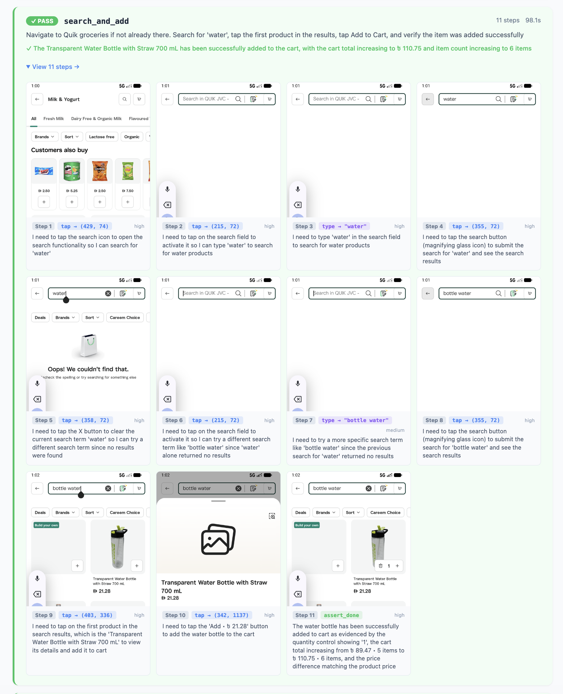

<!DOCTYPE html>
<html lang="en">
<head>
  <meta charset="UTF-8" />
  <meta name="viewport" content="width=device-width, initial-scale=1.0"/>
  <title>Abdul Rehman | Software Engineer</title>
  <link href="https://fonts.googleapis.com/css2?family=Syne:wght@400;600;700;800&family=DM+Mono:wght@300;400;500&display=swap" rel="stylesheet">
  
</head>
<body>

  

  

  <!-- NAV -->
  <nav>
    <a href="#" class="nav-logo">AR.</a>
    <ul class="nav-links">
      <li><a href="#about">About</a></li>
      <li><a href="#experience">Experience</a></li>
      <li><a href="#projects">Projects</a></li>
      <li><a href="#skills">Skills</a></li>
      <li><a href="#contact">Contact</a></li>
    </ul>
  </nav>

  <!-- HERO -->
  

    

      
Currently @ Careem · Karachi, PK

      <h1 class="fade-in fade-in-2">
        Abdul Rehman
      </h1>
      

        Software Engineer building scalable automation systems, AI-driven QA workflows, and cloud infrastructure. Turning quality engineering into a competitive advantage.
      

      

        <a href="#experience" class="btn btn-primary">View Experience</a>
        <a href="#contact" class="btn btn-outline">Get in Touch</a>
      

    

  

  <!-- ABOUT -->
  <section id="about">
    

      
About

      <h2 class="section-title">Engineering quality at scale.</h2>
      

        

          

            I'm a <strong>Software Engineer</strong> specializing in automation, backend systems, and quality engineering. My work sits at the intersection of engineering rigor and AI-driven tooling — building systems that help teams ship faster without sacrificing reliability.
          

          

            At <strong>Careem</strong>, I work on large-scale QA infrastructure including AI-powered test generation, mobile automation agents, and a centralized QA portal that orchestrates end-to-end quality workflows across the SuperApp.
          

          

            I'm particularly interested in how <strong>AI and automation converge</strong> to eliminate manual bottlenecks in software delivery — from intelligent test generation to chaos engineering and observability.
          

        

        

          

            
2+

            
Years experience

          

          

            
10+

            
Tools & frameworks

          

          

            
AI

            
Driven workflows

          

          

            
☁️

            
AWS & DevOps

          

        

      

    

  </section>

  <!-- EXPERIENCE -->
  <section id="experience">
    

      
Experience

      <h2 class="section-title">Where I've worked.</h2>
      

        

          

          

            Careem
            Current
          

          
Software Engineer — QA

          
Oct 2025 – Present

          <ul class="timeline-bullets">
            <li>Worked on <strong>IKIGAI</strong>, a Go-based service that processes user-reported issues from the SuperApp (Instabug), enabling automated Slack notifications and Jira ticket creation.</li>
            <li>Contributed to a <strong>centralized QA Portal</strong> that orchestrates end-to-end quality workflows, hosting multiple AI-driven agents and integrations.</li>
            <li>Built AI agents for <strong>automated test plan generation and test case creation</strong>, improving coverage and reducing manual effort.</li>
            <li>Extended the portal with <strong>GenAI-powered PR feedback</strong>, enabling automated validation of acceptance criteria and test coverage during code reviews.</li>
            <li>Integrated QA workflows with <strong>Jira, AIO, and Figma</strong> using MCP-based orchestration.</li>
            <li>Performed <strong>load, chaos, and DDoS testing</strong> to validate system reliability under stress.</li>
            <li>Built an <strong>AI-based mobile automation agent</strong> that navigates the app, analyzes screenshots, and generates test reports — eliminating Appium dependency.</li>
            <li>Implemented mobile automation using <strong>Maestro and Sofy</strong> for cross-device reliability.</li>
          </ul>
        

        

          

          

            Co-Ventech
            Prev
          

          
Test Automation Engineer

          
Jun 2024 – Oct 2025

          <ul class="timeline-bullets">
            <li>Built <strong>scalable automation frameworks</strong> using Selenium, Playwright, and WebdriverIO, reducing regression cycles.</li>
            <li>Developed <strong>API automation suites</strong> using Rest-Assured and Postman for backend validation.</li>
            <li>Provisioned <strong>AWS infrastructure using Terraform</strong> for consistent, repeatable deployments.</li>
            <li>Integrated <strong>CI/CD pipelines</strong> using Jenkins and GitHub Actions.</li>
            <li>Conducted <strong>performance testing</strong> using JMeter and BlazeMeter to identify system bottlenecks.</li>
          </ul>
        

        

          

          

            FAST-NUCES
          

          
Student Lab Assistant — Data Structures

          
Aug 2023 – Dec 2023

          <ul class="timeline-bullets">
            <li>Conducted lab sessions and helped junior students understand complex data structure concepts.</li>
            <li>Reviewed and debugged student coding assignments.</li>
          </ul>
        

      

    

  </section>

  <!-- PROJECTS -->
  <section id="projects">
    

      
Projects

      <h2 class="section-title">Things I've built.</h2>
      

        <!-- AI AGENT — featured card with real screenshot placeholder -->
        

          

            <!-- Replace src with your actual screenshot: images/ai-agent-report.png -->
            
            

              <svg viewBox="0 0 400 180" xmlns="http://www.w3.org/2000/svg" width="100%">
                <rect width="400" height="180" fill="#0d0d18"/>
                <!-- mock step grid -->
                <g opacity="0.9">
                  <rect x="12" y="12" width="88" height="72" rx="4" fill="#111827" stroke="#1e293b" stroke-width="1"/>
                  <rect x="108" y="12" width="88" height="72" rx="4" fill="#111827" stroke="#1e293b" stroke-width="1"/>
                  <rect x="204" y="12" width="88" height="72" rx="4" fill="#111827" stroke="#1e293b" stroke-width="1"/>
                  <rect x="300" y="12" width="88" height="72" rx="4" fill="#111827" stroke="#1e293b" stroke-width="1"/>
                  <rect x="12" y="96" width="88" height="72" rx="4" fill="#111827" stroke="#1e293b" stroke-width="1"/>
                  <rect x="108" y="96" width="88" height="72" rx="4" fill="#111827" stroke="#1e293b" stroke-width="1"/>
                  <rect x="204" y="96" width="88" height="72" rx="4" fill="#111827" stroke="#1e293b" stroke-width="1"/>
                  <rect x="300" y="96" width="88" height="72" rx="4" fill="#111827" stroke="#22c55e" stroke-width="1.5"/>
                </g>
                <!-- step labels -->
                <text x="22" y="26" font-size="7" fill="#7c6aff" font-family="monospace">Step 1</text>
                <text x="118" y="26" font-size="7" fill="#7c6aff" font-family="monospace">Step 2</text>
                <text x="214" y="26" font-size="7" fill="#7c6aff" font-family="monospace">Step 3</text>
                <text x="310" y="26" font-size="7" fill="#7c6aff" font-family="monospace">Step 4</text>
                <text x="22" y="110" font-size="7" fill="#7c6aff" font-family="monospace">Step 5</text>
                <text x="118" y="110" font-size="7" fill="#7c6aff" font-family="monospace">Step 6</text>
                <text x="214" y="110" font-size="7" fill="#7c6aff" font-family="monospace">Step 7</text>
                <text x="310" y="110" font-size="7" fill="#22c55e" font-family="monospace">PASS ✓</text>
                <!-- mock phone screens -->
                <rect x="22" y="30" width="68" height="48" rx="3" fill="#1e293b"/>
                <rect x="118" y="30" width="68" height="48" rx="3" fill="#1e293b"/>
                <rect x="214" y="30" width="68" height="48" rx="3" fill="#1e293b"/>
                <rect x="310" y="30" width="68" height="48" rx="3" fill="#1e293b"/>
                <rect x="22" y="114" width="68" height="48" rx="3" fill="#1e293b"/>
                <rect x="118" y="114" width="68" height="48" rx="3" fill="#1e293b"/>
                <rect x="214" y="114" width="68" height="48" rx="3" fill="#1e293b"/>
                <rect x="310" y="114" width="68" height="48" rx="3" fill="#0f2a1a"/>
                <!-- pass badge top left -->
                <rect x="12" y="4" width="38" height="14" rx="2" fill="#16a34a"/>
                <text x="16" y="14" font-size="7" fill="white" font-family="monospace" font-weight="bold">✓ PASS</text>
                <!-- title -->
                <text x="58" y="13" font-size="8" fill="#94a3b8" font-family="monospace">search_and_add · 11 steps · 98.1s</text>
              </svg>
            

            

              87% pass rate
              8 flows
              0 Appium
            

          

          

            
AI · Mobile Automation

            
AI Mobile Automation Agent

            
Built an AI-driven mobile automation agent that navigates apps visually, analyzes screenshots at each step, and executes user flows — no Appium dependency. Achieved 87% pass rate across 8 smoke flows on first production run.

            

              PythonVision AIAppium-freeMaestroClaude
            

          

        

        <!-- QA ORCHESTRATION -->
        

          

            <svg viewBox="0 0 400 160" xmlns="http://www.w3.org/2000/svg" width="100%">
              <rect width="400" height="160" fill="#0d0d18"/>
              <!-- nodes -->
              <rect x="20" y="60" width="70" height="36" rx="4" fill="#1a1a2e" stroke="#7c6aff" stroke-width="1"/>
              <text x="55" y="83" font-size="9" fill="#a78bfa" font-family="monospace" text-anchor="middle">AI Agents</text>
              <rect x="115" y="60" width="70" height="36" rx="4" fill="#1a1a2e" stroke="#7c6aff" stroke-width="1"/>
              <text x="150" y="83" font-size="9" fill="#a78bfa" font-family="monospace" text-anchor="middle">QA Portal</text>
              <rect x="210" y="60" width="70" height="36" rx="4" fill="#1a1a2e" stroke="#00e5b0" stroke-width="1"/>
              <text x="245" y="83" font-size="9" fill="#00e5b0" font-family="monospace" text-anchor="middle">Jira / AIO</text>
              <rect x="305" y="60" width="70" height="36" rx="4" fill="#1a1a2e" stroke="#7c6aff" stroke-width="1"/>
              <text x="340" y="83" font-size="9" fill="#a78bfa" font-family="monospace" text-anchor="middle">Figma</text>
              <!-- arrows -->
              <line x1="90" y1="78" x2="115" y2="78" stroke="#7c6aff" stroke-width="1" marker-end="url(#arr)"/>
              <line x1="185" y1="78" x2="210" y2="78" stroke="#7c6aff" stroke-width="1" marker-end="url(#arr)"/>
              <line x1="280" y1="78" x2="305" y2="78" stroke="#7c6aff" stroke-width="1" marker-end="url(#arr)"/>
              <defs><marker id="arr" markerWidth="6" markerHeight="6" refX="3" refY="3" orient="auto"><path d="M0,0 L6,3 L0,6 Z" fill="#7c6aff"/></marker></defs>
              <!-- label -->
              <text x="200" y="140" font-size="9" fill="#475569" font-family="monospace" text-anchor="middle">MCP-based orchestration · PR feedback · test generation</text>
              <text x="200" y="24" font-size="10" fill="#64748b" font-family="monospace" text-anchor="middle">QA Orchestration Portal — End-to-End Workflow</text>
            </svg>
          

          

            
AI · QA Platform

            
QA Orchestration Portal

            
Centralized QA system integrating AI agents, Jira, Figma, and test management via MCP orchestration. Automates test generation, PR validation, and acceptance criteria checks.

            

              MCPLangChainJiraAIO TestsFigma
            

          

        

        <!-- AUTOMATION FRAMEWORK -->
        

          

            <svg viewBox="0 0 400 160" xmlns="http://www.w3.org/2000/svg" width="100%">
              <rect width="400" height="160" fill="#0d0d18"/>
              <!-- CI/CD pipeline visual -->
              <rect x="16" y="55" width="60" height="50" rx="4" fill="#111827" stroke="#1e293b" stroke-width="1"/>
              <text x="46" y="76" font-size="8" fill="#94a3b8" font-family="monospace" text-anchor="middle">UI Tests</text>
              <text x="46" y="90" font-size="7" fill="#64748b" font-family="monospace" text-anchor="middle">Selenium</text>
              <text x="46" y="101" font-size="7" fill="#64748b" font-family="monospace" text-anchor="middle">Playwright</text>
              <rect x="96" y="55" width="60" height="50" rx="4" fill="#111827" stroke="#1e293b" stroke-width="1"/>
              <text x="126" y="76" font-size="8" fill="#94a3b8" font-family="monospace" text-anchor="middle">API Tests</text>
              <text x="126" y="90" font-size="7" fill="#64748b" font-family="monospace" text-anchor="middle">Postman</text>
              <text x="126" y="101" font-size="7" fill="#64748b" font-family="monospace" text-anchor="middle">Rest-Assured</text>
              <rect x="176" y="55" width="60" height="50" rx="4" fill="#111827" stroke="#1e293b" stroke-width="1"/>
              <text x="206" y="76" font-size="8" fill="#94a3b8" font-family="monospace" text-anchor="middle">Mobile</text>
              <text x="206" y="90" font-size="7" fill="#64748b" font-family="monospace" text-anchor="middle">Appium</text>
              <text x="206" y="101" font-size="7" fill="#64748b" font-family="monospace" text-anchor="middle">WebdriverIO</text>
              <rect x="256" y="55" width="60" height="50" rx="4" fill="#111827" stroke="#22c55e" stroke-width="1"/>
              <text x="286" y="76" font-size="8" fill="#22c55e" font-family="monospace" text-anchor="middle">CI/CD</text>
              <text x="286" y="90" font-size="7" fill="#4ade80" font-family="monospace" text-anchor="middle">GitHub</text>
              <text x="286" y="101" font-size="7" fill="#4ade80" font-family="monospace" text-anchor="middle">Actions ✓</text>
              <rect x="336" y="55" width="52" height="50" rx="4" fill="#111827" stroke="#1e293b" stroke-width="1"/>
              <text x="362" y="76" font-size="8" fill="#94a3b8" font-family="monospace" text-anchor="middle">Report</text>
              <text x="362" y="90" font-size="7" fill="#64748b" font-family="monospace" text-anchor="middle">Allure</text>
              <text x="362" y="101" font-size="7" fill="#22c55e" font-family="monospace" text-anchor="middle">100% ✓</text>
              <!-- connecting lines -->
              <line x1="76" y1="80" x2="96" y2="80" stroke="#334155" stroke-width="1"/>
              <line x1="156" y1="80" x2="176" y2="80" stroke="#334155" stroke-width="1"/>
              <line x1="236" y1="80" x2="256" y2="80" stroke="#334155" stroke-width="1"/>
              <line x1="316" y1="80" x2="336" y2="80" stroke="#22c55e" stroke-width="1"/>
              <text x="200" y="24" font-size="10" fill="#64748b" font-family="monospace" text-anchor="middle">Multi-layer Framework · UI + API + Mobile + CI/CD</text>
              <text x="200" y="140" font-size="9" fill="#475569" font-family="monospace" text-anchor="middle">Allure reporting · BrowserStack cross-browser · Jenkins</text>
            </svg>
          

          

            
Automation · Framework

            
Automation Framework Suite

            
Multi-layer test automation framework covering UI (Selenium, Playwright), API (Postman, Rest-Assured), and Mobile (Appium, WebdriverIO). CI/CD integrated via GitHub Actions with Allure reporting dashboards.

            

              SeleniumPlaywrightWebdriverIORest-AssuredGitHub Actions
            

          

        

        <!-- PERFORMANCE TESTING -->
        

          

            <svg viewBox="0 0 400 160" xmlns="http://www.w3.org/2000/svg" width="100%">
              <rect width="400" height="160" fill="#0d0d18"/>
              <!-- bar chart mimicking JMeter aggregate -->
              <text x="200" y="20" font-size="10" fill="#64748b" font-family="monospace" text-anchor="middle">Aggregate Response Times (ms) · 75 samples</text>
              <!-- axes -->
              <line x1="40" y1="130" x2="380" y2="130" stroke="#1e293b" stroke-width="1"/>
              <line x1="40" y1="30" x2="40" y2="130" stroke="#1e293b" stroke-width="1"/>
              <!-- Request01 bars -->
              <rect x="60" y="110" width="16" height="20" fill="#7c6aff" opacity="0.8"/>
              <rect x="78" y="112" width="16" height="18" fill="#a78bfa" opacity="0.7"/>
              <rect x="96" y="125" width="16" height="5" fill="#22c55e" opacity="0.9"/>
              <rect x="114" y="84" width="16" height="46" fill="#475569" opacity="0.5"/>
              <!-- Request02 bars -->
              <rect x="170" y="60" width="16" height="70" fill="#7c6aff" opacity="0.8"/>
              <rect x="188" y="62" width="16" height="68" fill="#a78bfa" opacity="0.7"/>
              <rect x="206" y="110" width="16" height="20" fill="#22c55e" opacity="0.9"/>
              <rect x="224" y="35" width="16" height="95" fill="#ef4444" opacity="0.6"/>
              <!-- Request03 bars -->
              <rect x="280" y="70" width="16" height="60" fill="#7c6aff" opacity="0.8"/>
              <rect x="298" y="72" width="16" height="58" fill="#a78bfa" opacity="0.7"/>
              <rect x="316" y="118" width="16" height="12" fill="#22c55e" opacity="0.9"/>
              <rect x="334" y="40" width="16" height="90" fill="#ef4444" opacity="0.6"/>
              <!-- labels -->
              <text x="100" y="145" font-size="8" fill="#64748b" font-family="monospace" text-anchor="middle">Request01</text>
              <text x="210" y="145" font-size="8" fill="#ef4444" font-family="monospace" text-anchor="middle">Request02 ⚠</text>
              <text x="320" y="145" font-size="8" fill="#ef4444" font-family="monospace" text-anchor="middle">Request03 ⚠</text>
              <!-- legend -->
              <rect x="42" y="32" width="8" height="6" fill="#7c6aff"/>
              <text x="52" y="38" font-size="7" fill="#94a3b8" font-family="monospace">Avg</text>
              <rect x="75" y="32" width="8" height="6" fill="#ef4444" opacity="0.7"/>
              <text x="85" y="38" font-size="7" fill="#94a3b8" font-family="monospace">Max · 40% err</text>
            </svg>
          

          

            
Performance · Load Testing

            
Load Testing System

            
Designed and executed load, stress, and spike tests using JMeter across 3 API endpoints (75 samples). Identified Request02 and Request03 as bottlenecks with 40% error rates and 5740ms max response times — findings used to guide backend optimisation.

            

              JMeterBlazeMeterK6Performance Testing
            

          

        

        <!-- PLAYWRIGHT + MCP -->
        

          

            <svg viewBox="0 0 400 160" xmlns="http://www.w3.org/2000/svg" width="100%">
              <rect width="400" height="160" fill="#0d0d18"/>
              <!-- flow diagram -->
              <rect x="20" y="65" width="65" height="32" rx="4" fill="#1a1a2e" stroke="#00e5b0" stroke-width="1.5"/>
              <text x="52" y="85" font-size="9" fill="#00e5b0" font-family="monospace" text-anchor="middle">User Action</text>
              <rect x="110" y="65" width="65" height="32" rx="4" fill="#1a1a2e" stroke="#7c6aff" stroke-width="1"/>
              <text x="142" y="85" font-size="9" fill="#a78bfa" font-family="monospace" text-anchor="middle">Playwright</text>
              <rect x="200" y="65" width="65" height="32" rx="4" fill="#1a1a2e" stroke="#7c6aff" stroke-width="1"/>
              <text x="232" y="85" font-size="9" fill="#a78bfa" font-family="monospace" text-anchor="middle">MCP Layer</text>
              <rect x="290" y="65" width="65" height="32" rx="4" fill="#1a1a2e" stroke="#7c6aff" stroke-width="1"/>
              <text x="322" y="85" font-size="9" fill="#a78bfa" font-family="monospace" text-anchor="middle">Jira / AIO</text>
              <!-- arrows -->
              <line x1="85" y1="81" x2="110" y2="81" stroke="#00e5b0" stroke-width="1.5" marker-end="url(#arr2)"/>
              <line x1="175" y1="81" x2="200" y2="81" stroke="#7c6aff" stroke-width="1" marker-end="url(#arr3)"/>
              <line x1="265" y1="81" x2="290" y2="81" stroke="#7c6aff" stroke-width="1" marker-end="url(#arr3)"/>
              <defs>
                <marker id="arr2" markerWidth="6" markerHeight="6" refX="3" refY="3" orient="auto"><path d="M0,0 L6,3 L0,6 Z" fill="#00e5b0"/></marker>
                <marker id="arr3" markerWidth="6" markerHeight="6" refX="3" refY="3" orient="auto"><path d="M0,0 L6,3 L0,6 Z" fill="#7c6aff"/></marker>
              </defs>
              <text x="200" y="24" font-size="10" fill="#64748b" font-family="monospace" text-anchor="middle">Playwright + MCP Orchestration Layer</text>
              <text x="200" y="140" font-size="9" fill="#475569" font-family="monospace" text-anchor="middle">Zero manual handoff · AI-driven execution · auto-reporting</text>
            </svg>
          

          

            
AI · UI Automation

            
Playwright + MCP Integration

            
UI automation framework using Playwright with MCP-based orchestration for AI-driven dynamic test execution. Results flow automatically into Jira and test management — zero manual handoff from test run to report.

            

              PlaywrightMCPJiraAI Agents
            

          

        

        <!-- AWS INFRA -->
        

          

            <svg viewBox="0 0 400 160" xmlns="http://www.w3.org/2000/svg" width="100%">
              <rect width="400" height="160" fill="#0d0d18"/>
              <!-- infrastructure diagram -->
              <rect x="160" y="20" width="80" height="28" rx="4" fill="#1a1a2e" stroke="#f59e0b" stroke-width="1"/>
              <text x="200" y="38" font-size="9" fill="#fbbf24" font-family="monospace" text-anchor="middle">ALB</text>
              <!-- arrows down -->
              <line x1="200" y1="48" x2="120" y2="72" stroke="#334155" stroke-width="1"/>
              <line x1="200" y1="48" x2="200" y2="72" stroke="#334155" stroke-width="1"/>
              <line x1="200" y1="48" x2="280" y2="72" stroke="#334155" stroke-width="1"/>
              <!-- EC2 instances -->
              <rect x="70" y="72" width="70" height="28" rx="4" fill="#1a1a2e" stroke="#7c6aff" stroke-width="1"/>
              <text x="105" y="90" font-size="9" fill="#a78bfa" font-family="monospace" text-anchor="middle">EC2 ×3</text>
              <rect x="160" y="72" width="70" height="28" rx="4" fill="#1a1a2e" stroke="#7c6aff" stroke-width="1"/>
              <text x="195" y="90" font-size="9" fill="#a78bfa" font-family="monospace" text-anchor="middle">Auto Scale</text>
              <rect x="250" y="72" width="70" height="28" rx="4" fill="#1a1a2e" stroke="#00e5b0" stroke-width="1"/>
              <text x="285" y="90" font-size="9" fill="#00e5b0" font-family="monospace" text-anchor="middle">Prometheus</text>
              <!-- bottom row -->
              <rect x="100" y="120" width="70" height="28" rx="4" fill="#1a1a2e" stroke="#1e293b" stroke-width="1"/>
              <text x="135" y="138" font-size="9" fill="#64748b" font-family="monospace" text-anchor="middle">Terraform</text>
              <rect x="210" y="120" width="70" height="28" rx="4" fill="#1a1a2e" stroke="#f97316" stroke-width="1"/>
              <text x="245" y="138" font-size="9" fill="#fb923c" font-family="monospace" text-anchor="middle">Grafana</text>
              <line x1="285" y1="100" x2="245" y2="120" stroke="#334155" stroke-width="1"/>
              <text x="200" y="15" font-size="10" fill="#64748b" font-family="monospace" text-anchor="middle">AWS Infrastructure · Terraform · Observability</text>
            </svg>
          

          

            
DevOps · Cloud

            
AWS Cloud Infrastructure

            
Production-grade AWS infrastructure provisioned with Terraform — ALB, EC2 auto-scaling, Prometheus monitoring, and Grafana dashboards for full observability stack.

            

              AWSTerraformPrometheusGrafanaDocker
            

          

        

      

    

  </section>

  <!-- SKILLS -->
  <section id="skills">
    

      
Skills

      <h2 class="section-title">Tech stack.</h2>
      

        

          
Languages

          

            Python
            JavaScript
            TypeScript
            Java
            Go
            SQL
          

        

        

          
Automation

          

            Selenium
            Playwright
            WebdriverIO
            Appium
            Maestro
            Sofy
          

        

        

          
AI & Agents

          

            LangChain
            MCP
            RAG
            Prompt Engineering
            Claude Code
          

        

        

          
DevOps & Cloud

          

            AWS
            Terraform
            Docker
            Jenkins
            GitHub Actions
            CI/CD
          

        

        

          
Performance & Observability

          

            JMeter
            BlazeMeter
            K6
            Prometheus
            Grafana
          

        

        

          
Backend & APIs

          

            REST APIs
            Postman
            Rest-Assured
            Go
          

        

        

          
Tools & Process

          

            Jira
            AIO Tests
            Git
            Figma
            Agile
          

        

        

          
Concepts

          

            System Design
            Distributed Systems
            QA Strategy
            Chaos Engineering
            Scalability
          

        

      

    

  </section>

  <!-- CONTACT -->
  <section id="contact">
    

      

        

          
Contact

          <h2 class="contact-headline">Let's build something great.</h2>
          

            Open to interesting engineering roles, collaborations, and conversations around automation, AI, and quality systems. Based in Karachi — working globally.
          

          <a href="mailto:bawanyabdulrehman@gmail.com" class="btn btn-primary">Send an Email</a>
        

        

          <a href="mailto:bawanyabdulrehman@gmail.com" class="contact-link">
            
✉

            

              
Email

              
bawanyabdulrehman@gmail.com

            

          </a>
          <a href="https://linkedin.com/in/abdulrehmanbawany" target="_blank" class="contact-link">
            
in

            

              
LinkedIn

              
abdulrehmanbawany

            

          </a>
          <a href="https://github.com/bawanyabdulrehman" target="_blank" class="contact-link">
            
⌥

            

              
GitHub

              
bawanyabdulrehman

            

          </a>
          <a href="tel:+923113860984" class="contact-link">
            
☎

            

              
Phone

              
+92 311 3860984

            

          </a>
        

      

    

  </section>

  <!-- FOOTER -->
  <footer>
    © 2025 Abdul Rehman · Built with precision.
  </footer>

</body>
</html>
